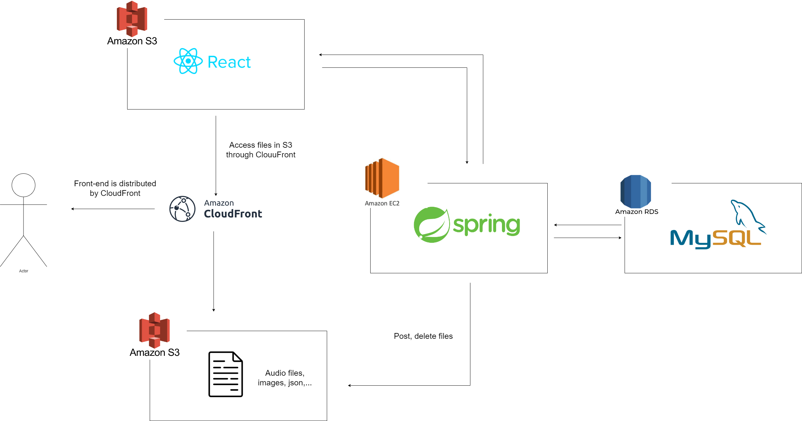

## SoundCloud Clone Project
---
## Demo 
  * link: https://aws3-demo.link/QIMExV
---
## Technologies:
  * Front-end using React, Redux and other libraries. 
  * Audio waveform using wavesurfer.js library.
  * Back-end using Spring.
  * Database is MySQL.
  * Deploy to AWS and dockerize with Docker.
---
## Project flow:
  * Front-end is stored in AWS S3, distributed through AWS CloudFront.
  * Files, tracks and images are also stored in S3 and delivered by CloudFront.
  * Back-end is deployed to AWS EC2.
  * Database is stored in AWS RDS.

